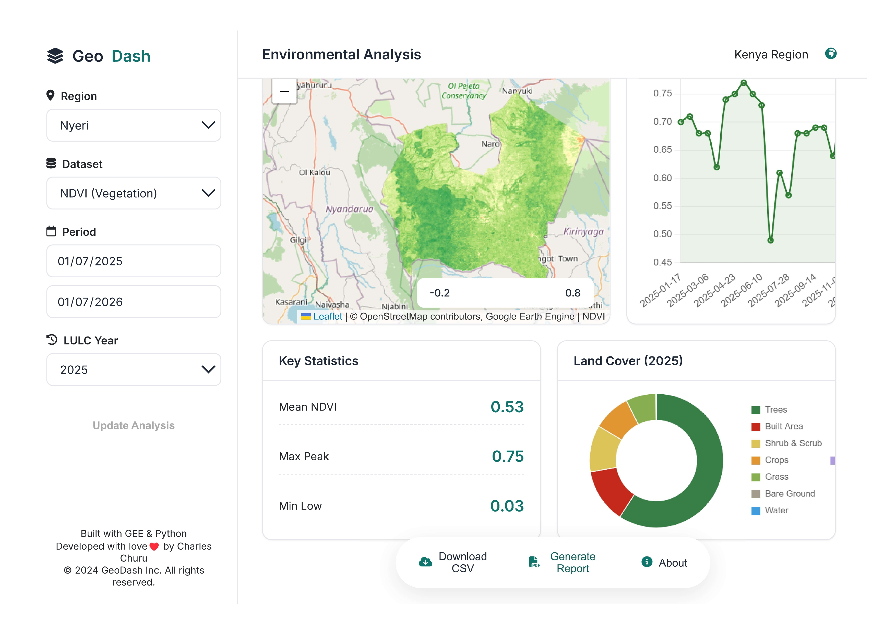

# Geospatial Analytics Dashboard 🌍

A powerful, interactive web application for monitoring and analyzing environmental data in Kenya using remote sensing technology. Built with **Flask**, **Google Earth Engine (GEE)**, and **Leaflet.js**, this dashboard provides real-time insights into vegetation health, land surface temperature, land cover changes, and topographic analysis.



## 🚀 Key Features

- **Raster Analysis:**
  - **NDVI (Vegetation Health):** Visualize vegetation density using Sentinel-2 data.
  - **LST (Land Surface Temperature):** Map surface temperature using Landsat 8 thermal bands.
- **3D Terrain Visualization:**
  - Explore topographic elevation using **NASA SRTM DEM** data.
  - Beautiful hypsometric tint visualization (Green → Yellow → Brown → White).
- **Vector Data Integration:**
  - View administrative boundaries (Counties) with area calculations.
- **Interactive Analytics:**
  - **Time Series Charts:** Track environmental trends over time.
  - **Dynamic Pie Charts:** Analyze land cover distribution by area (km²).
- **Reporting Tools:**
  - **CSV Export:** Download raw data for further analysis.
  - **PDF Reports:** Generate instant printable reports of the current view.

## 🛠️ Tech Stack

- **Backend:** Python 3, Flask
- **Geospatial Engine:** Google Earth Engine (GEE) API
- **Frontend:** HTML5, CSS3, JavaScript
- **Libraries:**
  - [Leaflet.js](https://leafletjs.com/) (Interactive Maps)
  - [Chart.js](https://www.chartjs.org/) (Data Visualization)
  - [FontAwesome](https://fontawesome.com/) (Icons)
- **Data Handling:** Pandas

## 📋 Prerequisites

Before you begin, ensure you have the following installed:

- **Python 3.9+**
- **Google Earth Engine Account:** You must have an active GEE account and project. [Sign up here](https://earthengine.google.com/).

## ⚙️ Installation & Setup

1.  **Clone the Repository**

    ```bash
    git clone [https://github.com/yourusername/geospatial-dashboard.git](https://github.com/yourusername/geospatial-dashboard.git)
    cd geospatial-dashboard
    ```

2.  **Create a Virtual Environment (Optional but Recommended)**

    ```bash
    python -m venv venv
    # Windows
    venv\Scripts\activate
    # macOS/Linux
    source venv/bin/activate
    ```

3.  **Install Dependencies**

    ```bash
    pip install -r requirements.txt
    ```

4.  **Authenticate Google Earth Engine**
    Run the authentication command and follow the link in your terminal to authorize access:

    ```bash
    earthengine authenticate
    ```

5.  **Configure Project ID**
    Open `app.py` and locate the initialization block (around line 12). Replace `'ee-c4708911'` with your own Google Earth Engine Project ID if necessary:

    ```python
    try:
        ee.Initialize(project='your-project-id-here')
    except:
        # ...
    ```

6.  **Run the Application**

    ```bash
    python app.py
    ```

    You should see output indicating the server is running (usually on port 5000).

7.  **Access the Dashboard**
    Open your web browser and navigate to:
    `http://127.0.0.1:5000/`

## 📂 Project Structure

```text
/geospatial-dashboard
│
├── app.py                 # Main Flask Application (Backend API)
├── requirements.txt       # Python dependencies
├── generate_docs.py       # Script to generate project documentation
├── templates/
│   └── dashboard.html     # Main User Interface (HTML)
└── static/
    ├── style.css          # Styling (CSS)
    └── script.js          # Client-side Logic (JS)
```

## 🧩 Usage Guide

1. **Select a Region:** Choose a county (e.g., Nyeri, Nairobi) from the sidebar dropdown.
2. **Choose Analysis Mode:**

- **Raster Analysis:** Select a dataset (NDVI, LST.) and date range. Click "Update Analysis".
- **Vector Data:** Click the "Vector Data" tab to view boundaries and area stats.
- **3D Terrain:** Click the "3D Terrain" tab to view elevation models.

3. **Analyze Data:** view the interactive map, time-series trend chart, and land cover distribution pie chart.
4. **Export:** Use the footer buttons to download data as CSV or print a PDF report.

## 🤝 Contributing

Contributions are welcome! Please feel free to submit a Pull Request.

1. Fork the project
2. Create your feature branch (`git checkout -b feature/AmazingFeature`)
3. Commit your changes (`git commit -m 'Add some AmazingFeature'`)
4. Push to the branch (`git push origin feature/AmazingFeature`)
5. Open a Pull Request

## 📄 License

This project is licensed under the MIT License - see the [LICENSE](https://www.google.com/search?q=LICENSE) file for details.

## 👤 Author

**Charles Churu**

- **Role:** GIS & Remote Sensing Analyst
- **System Version:** 1.0.0

---

_Built with ❤️ for Environmental Monitoring in Kenya._
